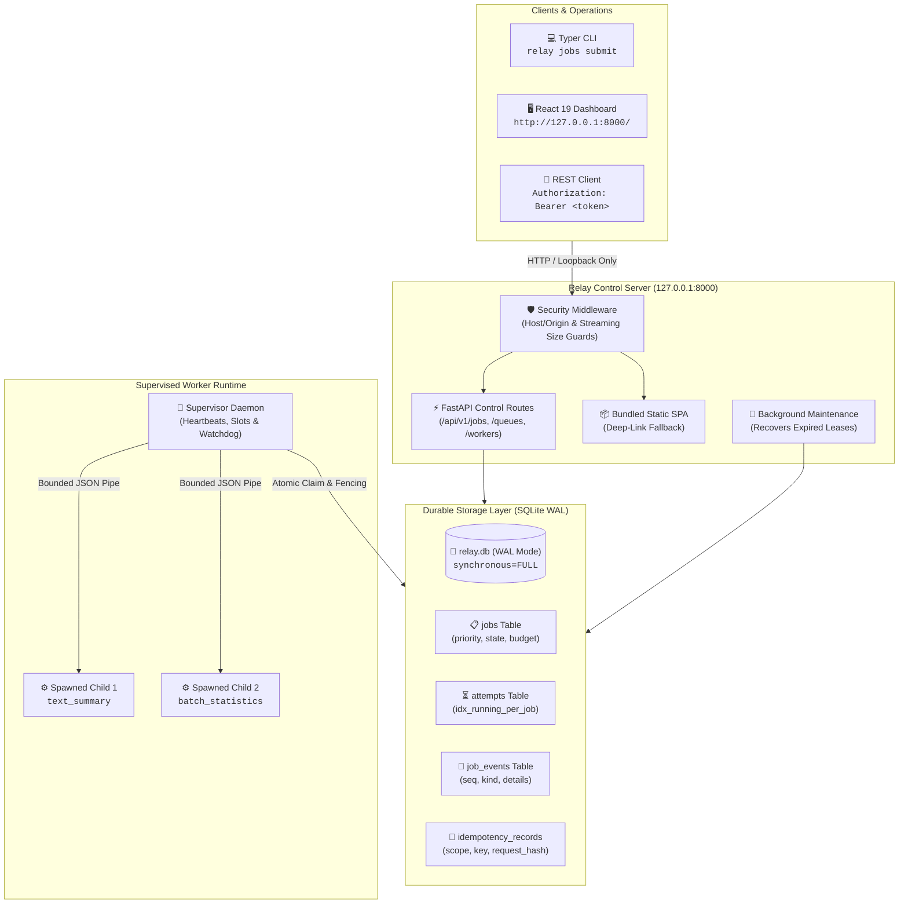
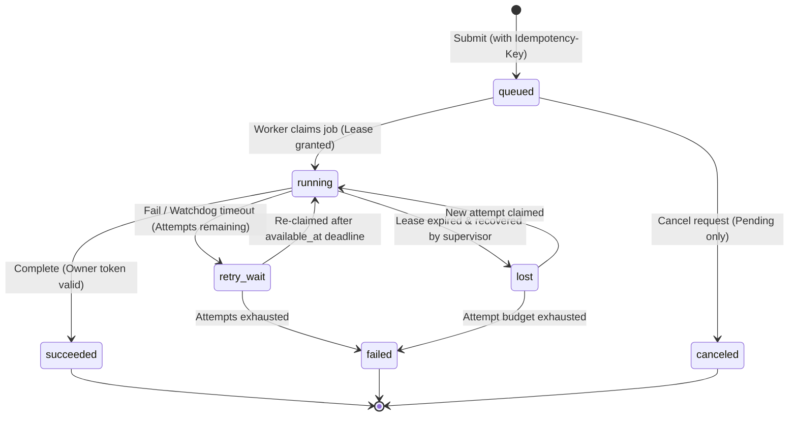

# ⚡ Relay (`relay-jobs`)

<p align="left">
  <strong>The inspectable, local-first background job engine for Python.</strong><br>
  Durable task execution, atomic lease fencing, and attempt immutability on SQLite WAL — zero external brokers required.
</p>

<p align="left">
  <a href="#test-matrix-and-verification"></a>
  <a href="#-architecture"></a>
  <a href="#-core-guarantees"></a>
  <a href="#2-start-the-loopback-api-server--dashboard"></a>
  <a href="#2-start-the-loopback-api-server--dashboard"></a>
  <a href="relay/LICENSE"></a>
</p>

---

> [!IMPORTANT]
> **No Broker Tax**: Relay requires **no Redis, no RabbitMQ, no Celery Flower, and no Docker daemon** to run. It gives you production-grade background job guarantees (leases, retries, dead-letter recovery, attempt history) on single-host systems using native SQLite WAL with immediate transactions.

---

## 🎯 Key Highlights

| Feature | Description |
| :--- | :--- |
| 🛡️ **Atomic Lease Fencing** | Time-bounded owner tokens and partial unique database indexes guarantee that zombie, hung, or delayed workers can **never** commit results after a lease expires. |
| 🔍 **Immutable Attempt Ledger** | Full execution transparency. Every attempt records worker hostname, PID, exact start/finish timestamps, error summaries, and duration. |
| ⚡ **Zero-Broker Simplicity** | Embedded SQLite WAL engine (`synchronous=FULL`, `busy_timeout=5000`) delivers hundreds of durable transitions/sec with zero external ports. |
| ⏱️ **Supervised Child Isolation** | Tasks run in isolated child processes via Python's `spawn` context with bounded pipe IPC and watchdog deadlines; crashes never take down the engine. |
| 📦 **Single-Wheel Web UI** | The React 19 / TypeScript operations dashboard is pre-built and embedded inside the wheel. Served directly by FastAPI with zero Node.js runtime needed. |
| 🔁 **Deterministic Idempotency** | Cryptographic request hashing prevents duplicate job records for the same client request key across submissions and retries. |

---

## 🏗️ Architecture



---

## 🔄 State Machine & Failure Recovery

Every state transition is verified atomic and persisted to the ledger:



---

## 📊 How Relay Compares

| Feature | Relay (`relay-jobs`) | Celery | RQ | Temporal |
| :--- | :---: | :---: | :---: | :---: |
| **External Broker** | **None** (Embedded SQLite WAL) | Redis / RabbitMQ | Redis | PostgreSQL / Cassandra |
| **Lease Fencing** | ✅ **Database-Enforced Owner Tokens** | ❌ Visibility timeout races | ❌ Key TTL races | ✅ Activity Heartbeats |
| **Inspectable History** | ✅ **Full DB Attempt/Event Ledger** | ❌ Ephemeral / lost in logs | ❌ Ephemeral metadata | ✅ Event History |
| **Operations UI** | ✅ **Bundled Zero-Node React Dashboard** | ⚠️ Flower (separate setup) | ⚠️ rq-dashboard | ✅ Temporal Web UI |
| **Worker Isolation** | ✅ **Spawned Child + Watchdog IPC** | Fork / Prefork | Fork | Process / Worker Host |
| **Installation** | **Single Wheel** (`pipx install relay-jobs`) | Multi-service stack | Multi-service stack | Distributed cluster |

---

## 🚀 Quickstart

### 1. Initialize Data Directory & Credentials

```powershell
cd relay
.\.venv\Scripts\relay.exe init
```
> [!NOTE]
> Generates a cryptographically random 256-bit token stored with restricted user-only file permissions (Windows SID-based ACL / POSIX 0600) and prepares the SQLite database.

### 2. Start the Loopback API Server & Dashboard

```powershell
.\.venv\Scripts\relay.exe serve --port 8000
```
Open [http://127.0.0.1:8000](http://127.0.0.1:8000) in your browser. Enter the token printed by `init` to access the live operations dashboard.

### 3. Start a Worker Supervisor

```powershell
.\.venv\Scripts\relay.exe worker start --concurrency 2
```

### 4. Enqueue Work & Inspect Health

```powershell
# Enqueue a text analysis job
.\.venv\Scripts\relay.exe jobs submit text_summary --payload '{"text": "Relay background jobs in Python"}'

# Enqueue with idempotency protection
.\.venv\Scripts\relay.exe jobs submit text_summary --payload '{"text": "Deduplicated"}' --idempotency-key "req-42"

# Inspect local health & migration status
.\.venv\Scripts\relay.exe doctor
```

---

## 🧪 Test Matrix & Verification

Relay is tested with an exhaustive matrix covering concurrency, crash rollbacks, and release isolation:

```powershell
cd relay

# Run the 94 Python tests (concurrency, races, lifecycle, migrations)
.\.venv\Scripts\python.exe -m pytest

# Run React dashboard test suite (Vitest + Testing Library)
npm --prefix web test

# Run live full-stack end-to-end verification
.\.venv\Scripts\python.exe scripts/e2e_fullstack.py
```

### Measured Core Performance
Measured on Windows 11 / AMD 12-core / SQLite 3.49.1 / WAL mode (`synchronous=FULL`):
- **1 Worker Thread**: **988 submit jobs/sec**, **425 drain jobs/sec**, p50 claim latency **1.21 ms**.
- **4 Worker Threads**: **957 submit jobs/sec**, **283 drain jobs/sec** (bounded by SQLite single-writer serialization).

---

## 📁 Repository Organization

```text
resumeproject/
├── README.md                 # Visual overview and guide
├── AGENTS.md                 # Coding agent conventions & safety rules
├── docs/
│   ├── devlog/               # Measured benchmarks and release verification logs
│   └── relay/                # Architecture, threat model, runbook, and ADRs
└── relay/                    # Application package
    ├── pyproject.toml        # Python manifest (hatchling backend)
    ├── uv.lock               # Deterministic dependency lockfile
    ├── Dockerfile            # Multi-stage production container
    ├── compose.yaml          # Service isolation specification
    ├── src/relay/            # Domain, storage, worker supervisor, API, and CLI
    ├── tests/                # T01-T24 acceptance test suite
    ├── web/                  # React 19 + TypeScript + Vite operations dashboard
    └── scripts/              # Release builder, benchmarks, and E2E runner
```

---

## 📜 License

Relay is licensed under the [Apache License, Version 2.0](relay/LICENSE).

