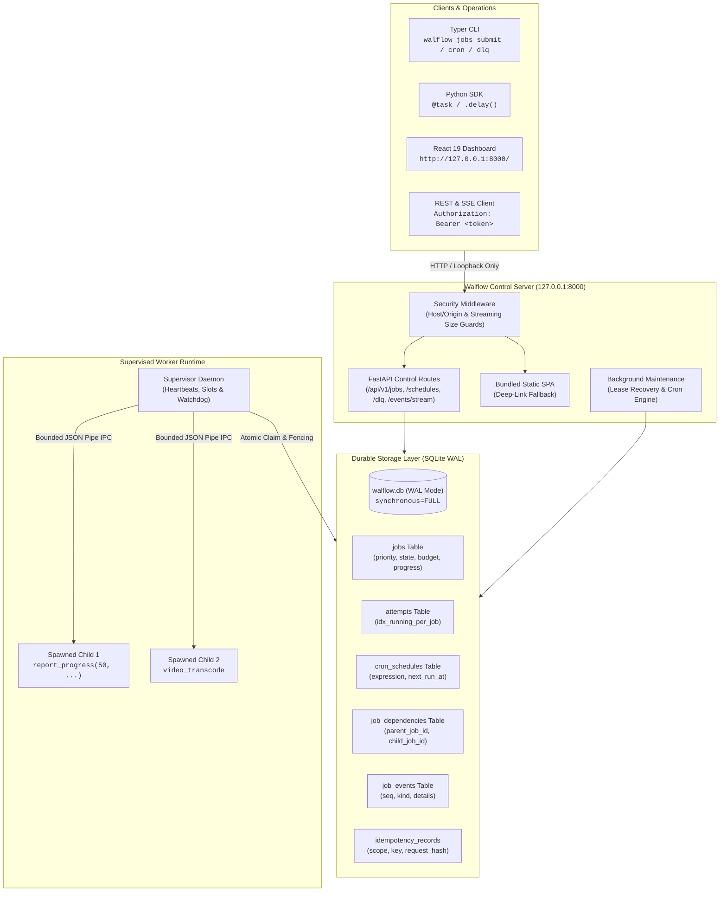
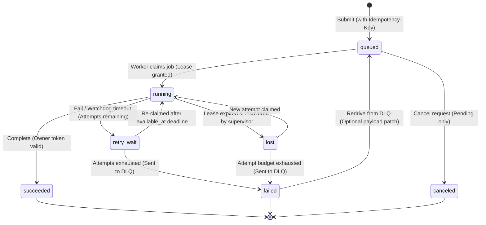

# Walflow (`walflow`)

<p align="left">
  <strong>The inspectable, local-first background job engine for Python.</strong><br>
  Durable task execution, atomic lease fencing, cron scheduling, DLQ remediation, and DAG pipelines on SQLite WAL — zero external brokers required.
</p>

<p align="left">
  <a href="#test-matrix-and-verification"></a>
  <a href="#architecture-and-subsystems"></a>
  <a href="#key-capabilities"></a>
  <a href="#quickstart"></a>
  <a href="#quickstart"></a>
  <a href="relay/LICENSE"></a>
</p>

---

> [!IMPORTANT]
> **No Broker Tax**: Walflow requires **no Redis, no RabbitMQ, no Celery Flower, and no Docker daemon** to run. It delivers production-grade background job guarantees (leases, retries, dead-letter recovery, attempt history, recurring schedules, and dependency pipelines) on single-host systems using native SQLite WAL with immediate write transactions.

---

## Architecture & Subsystems



---

## Key Capabilities

| Subsystem | Badge | Description |
| :--- | :---: | :--- |
| **Atomic Lease Fencing** | `[CORE]` | Time-bounded owner tokens and partial unique database indexes guarantee that zombie, hung, or delayed workers can **never** commit results after a lease expires. |
| **Pythonic Task Decorator** | `[SDK]` | Modern, ergonomic `@task(queue="...", priority=...)` decorator with type-safe `.delay(...)` dispatch and pipeline chaining. |
| **Drift-Free Cron Engine** | `[CRON]` | Standard 5-field cron parser evaluating recurring schedules atomically in SQLite transactions. Immune to worker restarts and drift. |
| **Dead-Letter Queue & Redrive** | `[DLQ]` | Automatically captures exhausted jobs with full error traces. Supports single and bulk redriving with in-flight payload correction. |
| **Dependency Pipelines (DAG)** | `[DAG]` | Declare task prerequisites with `depends_on=[...]`. Blocked jobs are indexed out of claim loops and unblock automatically on parent completion. |
| **In-Flight Progress Tracking** | `[IPC]` | Supervised child tasks report progress percentages and messages over bounded IPC pipes, automatically synced to database heartbeats and SSE. |
| **Immutable Attempt Ledger** | `[CORE]` | Full execution transparency. Every attempt records worker hostname, PID, exact start/finish timestamps, error summaries, and duration. |
| **Single-Wheel Web UI** | `[UI]` | The React 19 / TypeScript operations dashboard is pre-built and embedded inside the Python wheel. Served directly with zero Node.js runtime required. |
| **Deterministic Idempotency** | `[CORE]` | Cryptographic request hashing prevents duplicate job records for the same client request key across submissions and retries. |

---

## State Machine & Failure Recovery

Every state transition is verified atomic and persisted to the immutable audit ledger:



---

## How Walflow Compares

| Feature | Walflow (`walflow`) | Celery | RQ | Temporal |
| :--- | :---: | :---: | :---: | :---: |
| **External Broker** | **None** (Embedded SQLite WAL) | Redis / RabbitMQ | Redis | PostgreSQL / Cassandra |
| **Lease Fencing** | **Database-Enforced Owner Tokens** | Visibility timeout races | Key TTL races | Activity Heartbeats |
| **Python SDK** | **`@task` + `.delay()`** | `@app.task` + `.delay()` | `@job` decorator | Workflow / Activity SDK |
| **Cron Schedules** | **Integrated SQLite Engine** | Celery Beat (extra process) | rq-scheduler (extra daemon) | Temporal Schedules |
| **Dead-Letter Queue** | **Built-in DLQ + Bulk Redrive** | Manual routing config | FailedJobRegistry | Execution Reset API |
| **DAG Pipelines** | **`depends_on` Cascade Resolution** | Canvas primitives (chains/chords) | Simple depends_on | Orchestrated Workflows |
| **Progress Reporting** | **Child IPC -> DB Heartbeat -> SSE** | Custom state update | Custom meta dict | Activity Heartbeat details |
| **Operations UI** | **Bundled Zero-Node React Dashboard** | Flower (separate setup) | rq-dashboard | Temporal Web UI |
| **Worker Isolation** | **Spawned Child + Watchdog IPC** | Fork / Prefork | Fork | Process / Worker Host |
| **Installation** | **Single Wheel** (`pipx install walflow`) | Multi-service stack | Multi-service stack | Distributed cluster |

---

## Quickstart

### 1. Initialize Data Directory & Credentials

```powershell
cd relay
.\.venv\Scripts\walflow.exe init
```

> [!NOTE]
> Generates a cryptographically random 256-bit token stored with restricted user-only file permissions (Windows SID-based ACL / POSIX 0600) and executes schema migrations.

### 2. Start the Loopback API Server & Dashboard

```powershell
.\.venv\Scripts\walflow.exe serve --port 8000
```

Open [http://127.0.0.1:8000](http://127.0.0.1:8000) in your browser. Enter the token printed by `init` to access the live operations dashboard.

### 3. Start a Worker Supervisor

```powershell
.\.venv\Scripts\walflow.exe worker start --concurrency 4
```

### 4. Define and Enqueue Tasks with the Python SDK

```python
from walflow import Walflow, progress, task

app = Walflow()

@task(queue="media", priority=10, timeout_ms=60000, max_attempts=3)
def extract_frames(video_url: str) -> dict[str, int]:
    progress(15, "Downloading stream...")
    # ... processing ...
    progress(75, "Extracting video frames...")
    # ... processing ...
    progress(100, "Frames extracted successfully")
    return {"frames_extracted": 1420}

@task(queue="notifications", priority=5)
def notify_pipeline_complete(user_id: str) -> dict[str, str]:
    return {"status": "dispatched"}

# Dispatch task execution
job_id = extract_frames.delay(video_url="https://example.com/stream.mp4")

# Pipeline task execution with dependencies (DAG)
notify_pipeline_complete.delay(user_id="user_123", depends_on=[job_id])
```

### 5. Manage via Command Line Interface (CLI)

#### Jobs & Health
```powershell
# Enqueue a job via CLI
.\.venv\Scripts\walflow.exe jobs submit text_summary --payload '{"text": "Walflow background jobs"}'

# List active jobs and inspect health
.\.venv\Scripts\walflow.exe jobs list --state running
.\.venv\Scripts\walflow.exe doctor
```

#### Cron Schedules
```powershell
# Register a recurring schedule (every hour at minute 0)
.\.venv\Scripts\walflow.exe cron add cleanup_temp "0 * * * *" cleanup_task

# List and manage schedules
.\.venv\Scripts\walflow.exe cron list
.\.venv\Scripts\walflow.exe cron pause cleanup_temp
.\.venv\Scripts\walflow.exe cron resume cleanup_temp
```

#### Dead-Letter Queue (DLQ)
```powershell
# View failed jobs in DLQ
.\.venv\Scripts\walflow.exe dlq list

# Redrive a specific job with patched payload
.\.venv\Scripts\walflow.exe dlq redrive <job-id> --payload '{"text": "fixed input"}'

# Bulk redrive all failed jobs for a handler
.\.venv\Scripts\walflow.exe dlq redrive-all --handler text_summary
```

---

## Test Matrix & Verification

Walflow is tested with an exhaustive matrix covering concurrency, crash rollbacks, and release isolation:

```powershell
cd relay

# Run the 104 Python tests (concurrency, races, lifecycle, migrations, SDK, DLQ, cron, DAG)
.\.venv\Scripts\python.exe -m pytest

# Run React dashboard test suite (Vitest + Testing Library)
npm --prefix web test

# Run live full-stack end-to-end verification
.\.venv\Scripts\python.exe scripts/e2e_fullstack.py
```

### Measured Core Performance
Measured on Windows 11 / AMD 12-core / SQLite 3.49.1 / WAL mode (`synchronous=FULL`):
- **1 Worker Thread**: **988 submit jobs/sec**, **425 drain jobs/sec**, p50 claim latency **1.21 ms**.
- **4 Worker Threads**: **957 submit jobs/sec**, **283 drain jobs/sec** (bounded by SQLite single-writer serialization).

---

## Repository Organization

```text
resumeproject/
├── README.md                 # Visual overview and documentation
├── AGENTS.md                 # Coding agent conventions and safety rules
├── docs/
│   ├── devlog/               # Measured benchmarks and release verification logs
│   └── relay/                # Architecture, threat model, runbook, and ADRs
└── relay/                    # Application package
    ├── pyproject.toml        # Python manifest (hatchling backend, walflow v0.2.0)
    ├── uv.lock               # Deterministic dependency lockfile
    ├── Dockerfile            # Multi-stage production container
    ├── compose.yaml          # Service isolation specification
    ├── src/walflow/          # Domain, storage, worker supervisor, SDK, API, and CLI
    │   ├── sdk.py            # @task decorator and Task abstraction
    │   ├── services/
    │   │   ├── cron.py       # Drift-free SQLite recurring schedule engine
    │   │   ├── dlq.py        # Dead-letter queue redrive service
    │   │   └── ...           # Submit, claim, complete, cancel services
    │   ├── cli/
    │   │   ├── cron.py       # CLI commands for cron schedule management
    │   │   ├── dlq.py        # CLI commands for dead-letter recovery
    │   │   └── ...           # Jobs, worker, auth, doctor CLI commands
    │   └── ...
    ├── tests/                # 104 automated tests (T01-T24, SDK, DLQ, Cron, DAG)
    ├── web/                  # React 19 + TypeScript + Vite operations dashboard
    └── scripts/              # Release builder, benchmarks, and E2E runner
```

---

## License

Walflow is licensed under the [Apache License, Version 2.0](relay/LICENSE).
